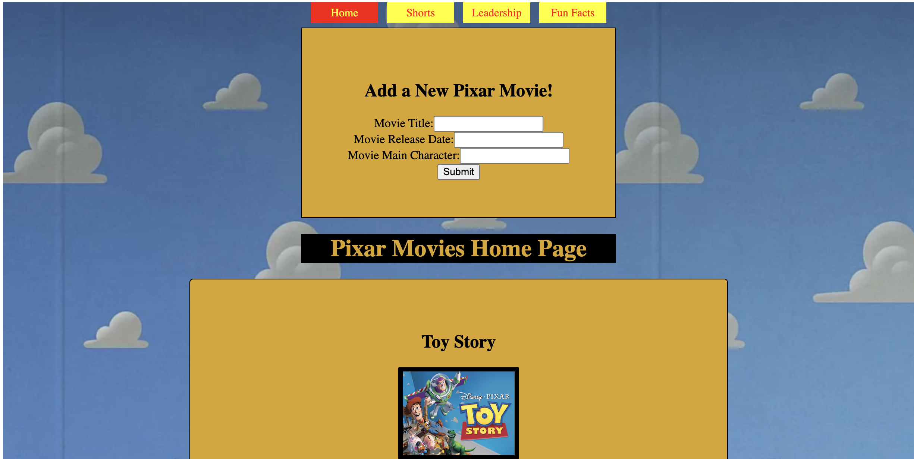

# The Pixar Collaboration #
============================================================================

# Introduction
----------------------------------------------------------------------------
Welcome to the Pixar Collaboration! This README.md file will walk through all of the features, CSS choices, and images used throughout this project. Also, this file will describe the each page within this project and all of their individual abilities. At the end, there will also be a link to the video example of the use of this app followed by a brief description! This app will hopefully answer any and every question there is about pixar films, shorts, leadership and fun facts!

This application uses JavaScript, JavaScript React, and CSS to create a database of information about the different pieces of Pixar's wonderful company. This application allows the user to access features such as:
            * Access each movie Pixar has created and learn about its release date, characters and a simple image of the movie.
            * Access each short film with a simple image of the film, along with a brief summary of the short from the press of a button.
            * A view of each executive in the Pixar company, along with their position in the company and what branch of the company they work in.
            * Lastly, a form containing a few fun facts about pixar, along with a form where you can submit your very own Pixar fun fact! 

----------------------------------------------------------------------------

Along with the features of this application, each movie creates its own url and removes its self from the origianl page. On this page is where you can find the facts about the film. 
Here are some of the basic movie images!

----------------------------------------------------------------------------

Another cool feature of this application is the use of CSS! There is a unique background image along with colors that are both made to resemble iconic films from Pixar history! The clouds background (pictured below) are from the Toy Story series and the color choices, red and yellow, for the NavBar and each card are also from the Toy Story series! These CSS choices really bring the entire application to life and provide a depth that wouldnt be possible without them!

============================================================================
# Usage
----------------------------------------------------------------------------
Link to video walkthrough:
*

This video is a complete walkthrough of all of the features and each page that is offered in this application. This provides an example of what the application looks like with the CSS choices, along with the feature that is on each page within the application.

This video really gives the insight as to how this application could be used or how it could be useful to the user. Each page makes its own fetch request to the server to collect the correct information and display it in the appropriate way.

============================================================================
# Code Examples
----------------------------------------------------------------------------

The following code snippet is an example of the fetch request made to grab a movie by its specific ID that allows the application to display only that movie at its own URL.
*

The following code snippet is an example of the NavBar part of the application which allows the user to access each individual page from any other page. This is a crucial piece of the functionability for the user within this application. 
*

The following two code snippets are examples of the fun fact POST form. This allows the user to view the previously posted fun facts, but also add their own fun fact to the list. 
*
*

These snippets allow insight into what makes this application function correctly and allows the user to access all of the exciting features offered within this application. 

============================================================================
# Citations

This application uses my own personal JSON, but also uses information from the sources below to give the correct information about each movie, short film, leadership position, and fun fact!

Sources:
        * https://www.pixar.com/feature-films-launch#top

        * https://external-preview.redd.it/9slU5TZV95bQool8Gq4d2Cjb9OkwwqjfEyJs3rOiuD8.jpg?auto=webp&s=6eea398ccce813e70586b5a401e592f0b0f29a8c

        * https://screenrant.com/pixar-movies-fun-facts/

        * https://www.pixar.com/short-films-1
        
        * https://www.pixar.com/leadership